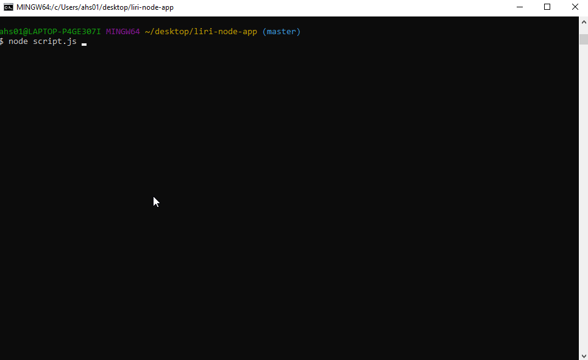

# **LIRI NODE APP**

## *Language Interpretation & Recognition Interface App*

* Project source can be downloaded from: https://github.com/ahs012/liri-node-app
<!-- In Progress ---------
* [For Presentation & Demo please click here](https://slides.com/smoss012/deck/live#/)  -->

---

## Purpose of Liri-Node-App

The purpose of **Liri-Node-App** is to assist in searching for artist/song information, as well as concert and movie information by the use of the OMDB and Spotify API. LIRI is a Language Interpretation and Recognition Interface that takes in certain parameters and returns desired information.

---

## Author & Contributor List

* [Albert Schumacher](github.com/ahs012) 

---

## App in action

# Spotify-this-song

# Concert-this

# Movie-this

---

## Technologies Used

* [Node Spotify API](https://www.npmjs.com/package/node-spotify-api) - Used to pull song information
* [AXIOS](https://www.npmjs.com/package/axios) - Used to pull information from the OMDB and Bands in Town API
* [Moment](https://www.npmjs.com/package/moment) 
* [Dotenv](https://www.npmjs.com/package/dotenv) 
* [FS](https://www.npmjs.com/package/fs) 

---